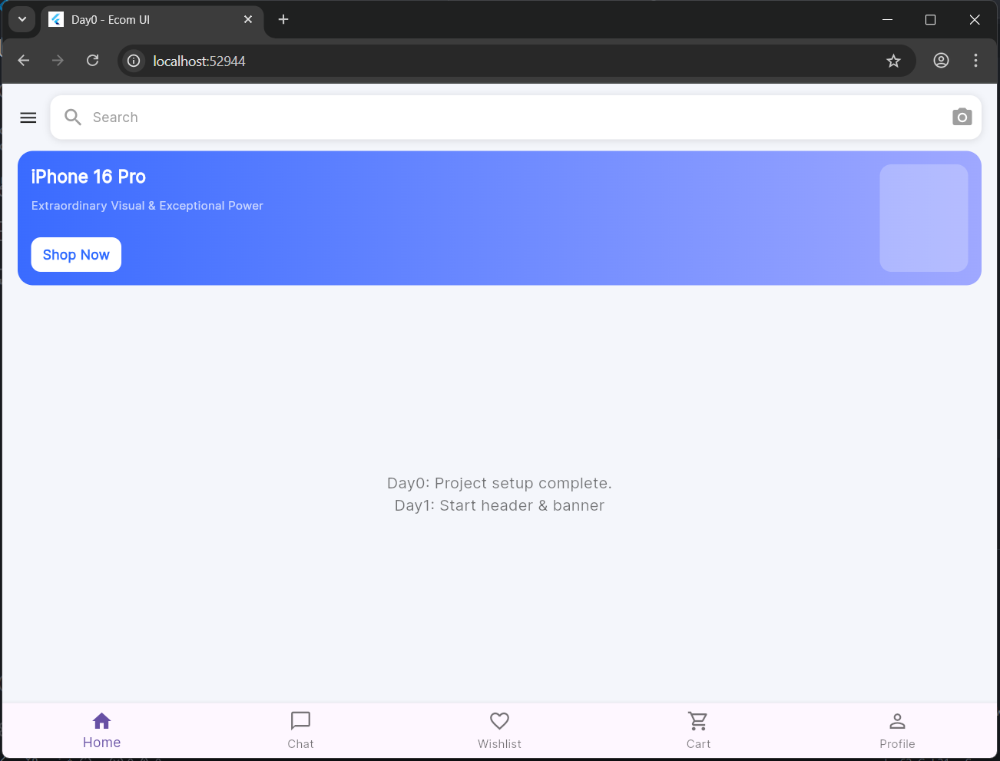

# day0

A new Flutter project.
# Day 0 – Flutter Setup & Initialization

## ✔ What I completed today
- Installed and configured Flutter SDK on Windows.
- Fixed PATH issues and verified Flutter installation (`flutter --version` working).
- Created the `day0` Flutter project using `flutter create day0`.
- Added essential packages: `google_fonts` and `flutter_svg`.
- Set up basic project theme and placeholder UI (TopSearchBar + Banner placeholder).
- Verified the app runs successfully on Windows Desktop / Chrome (`flutter run`).
- Created folder structure for upcoming days.

## 📸 Screenshot



## ✔ How to run this Day0 project
```bash
cd day0
flutter pub get
flutter run -d windows   # or chrome

## Getting Started

This project is a starting point for a Flutter application.

A few resources to get you started if this is your first Flutter project:

- [Lab: Write your first Flutter app](https://docs.flutter.dev/get-started/codelab)
- [Cookbook: Useful Flutter samples](https://docs.flutter.dev/cookbook)

For help getting started with Flutter development, view the
[online documentation](https://docs.flutter.dev/), which offers tutorials,
samples, guidance on mobile development, and a full API reference.
