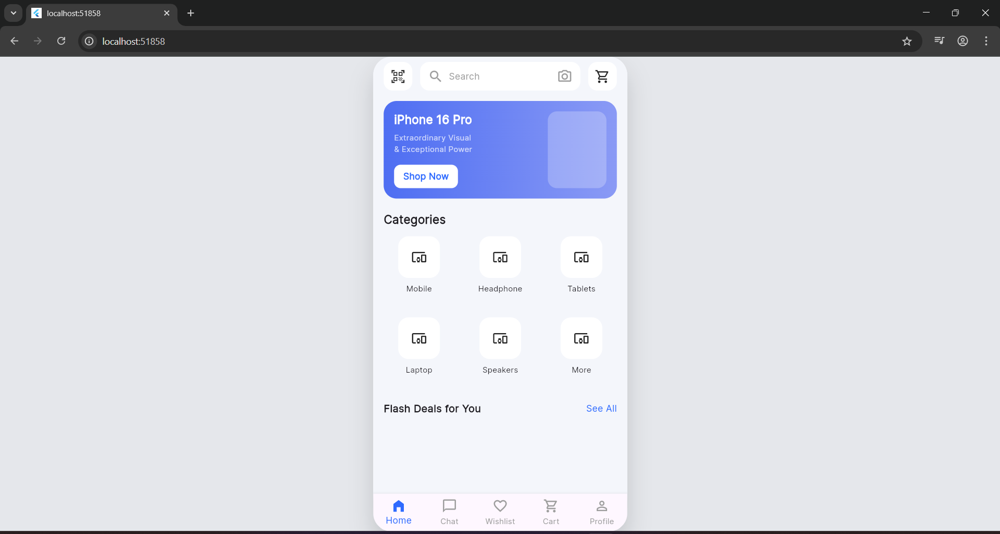

# Day 1 – Home Screen UI (Top Bar + Banner + Categories + Bottom Nav)

## ✔ What I completed today
- Built the Home screen UI based on the provided e-commerce mockup.
- Implemented:
  - Top search bar with QR scanner, search field, camera icon, and cart icon
  - Promotional banner card (iPhone 16 Pro)
  - Categories grid (Mobile, Headphone, Tablets, Laptop, Speakers, More)
  - Bottom navigation bar (Home, Chat, Wishlist, Cart, Profile)
- Added a custom phone-sized frame (390x844) with rounded corners to simulate mobile UI on web/desktop.
- Fixed layout overflow issues using `SingleChildScrollView`.
- Ensured pixel-aligned spacing, colors, and typography.

## 📸 Screenshot



## ✔ How to run
```bash
cd day1
flutter pub get
flutter run -d chrome
