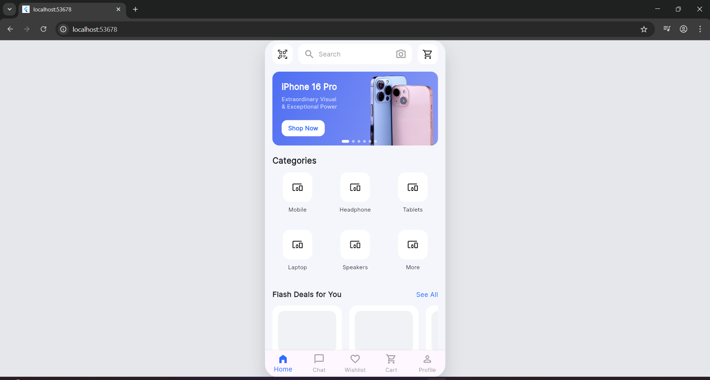

# Day 2 – Home Screen UI (Banner, Categories & Flash Deals)

## ✅ What I completed today
- Implemented **Home Screen UI** based on the provided e-commerce mockup.
- Built a **custom banner card** with:
  - Gradient background
  - Product title and subtitle
  - “Shop Now” CTA button
  - iPhone product image aligned to the right
  - Carousel-style dot indicators
- Integrated **image assets** properly using Flutter asset management.
- Created a **Categories grid** with rounded cards and icons.
- Implemented **Flash Deals** horizontal list with product cards.
- Ensured UI is rendered inside a **custom phone frame** to match mobile screen dimensions.
- Fixed layout overflow issues using `SingleChildScrollView` and proper constraints.
- Verified UI rendering on Flutter Web / Windows.


## 📸 Screenshot



## ✔ How to run
```bash
cd day2
flutter pub get
flutter run -d chrome
