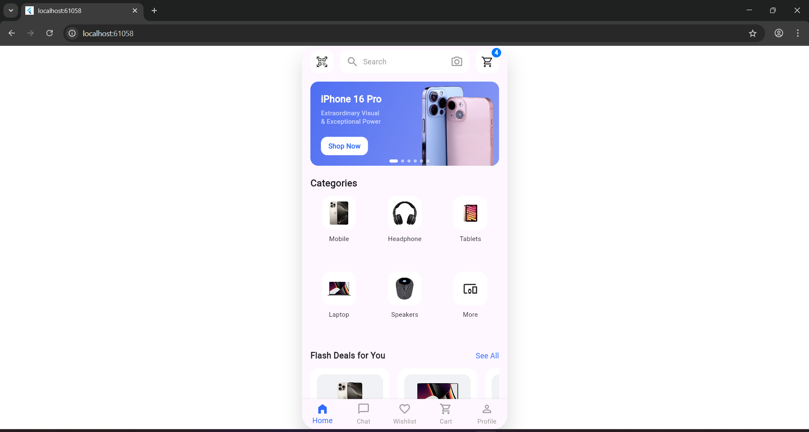

# Day 3 – Home Screen Completion (UI Only)

## Objective
Complete the full Home screen UI based on the provided e-commerce mockup.
The focus for Day 3 was **UI replication only**, with accurate spacing, colors,
layout, and component structure. No business logic or navigation functionality
was implemented.

## What was implemented
- Split UI into reusable widgets for better structure and readability
- Home screen layout with:
  - Top search bar with QR icon and cart badge
  - Promotional banner with gradient, product image, and carousel indicators
  - Categories section with image-based icons
  - Flash Deals horizontal product list with images and CTA
  - Bottom navigation bar
- Cart icon badge showing item count (UI only)
- iOS system colors applied for better design accuracy
- Mobile-style layout constrained using a phone frame for desktop/web preview

## Widgets created
- `TopSearchBar`
- `BannerCard`
- `CategoriesGrid`
- `FlashDealsList`
- `FlashDealCard`
- `BottomNavBar`
- `PhoneFrame`

## Learnings
- Proper widget separation improves maintainability and scalability
- `const` should be avoided for widgets that use dynamic data
- Flutter Web requires exact file names and imports
- Stack and Positioned are useful for overlay UI elements like badges
- UI replication can be done without implementing functionality

## Notes
- All UI components are static as per assignment instructions
- Assets were extracted from the provided design mockup
- Fonts and colors were matched closely to the reference image

## 📸 Screenshot



## ✔ How to run
```bash
cd day3
flutter pub get
flutter run -d chrome
