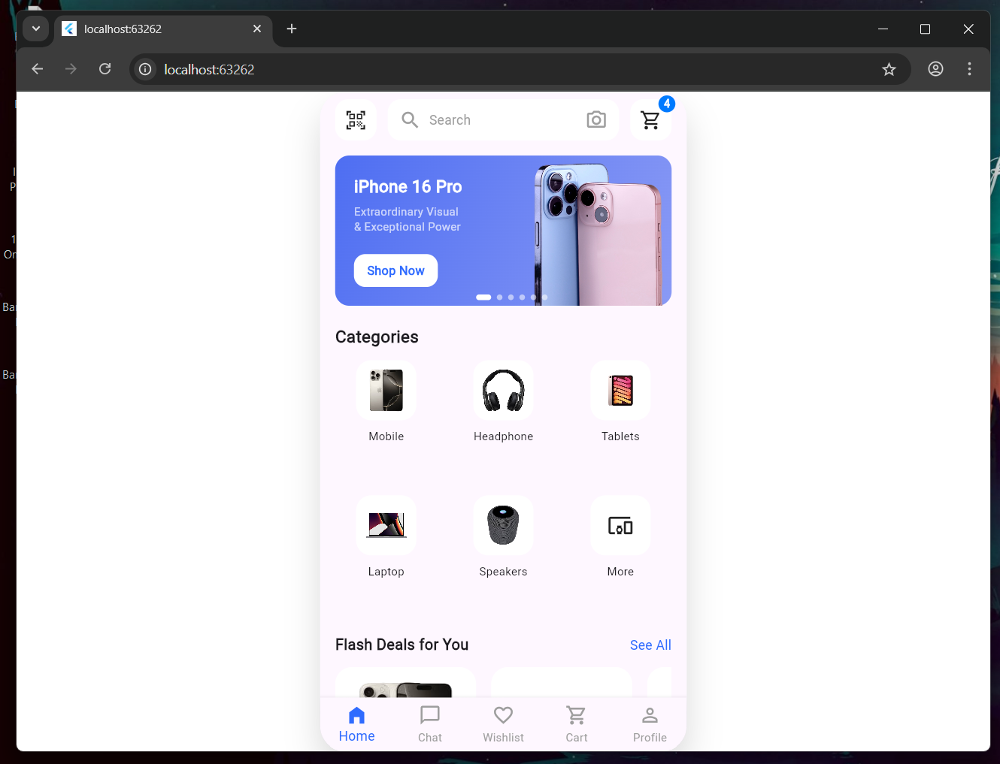
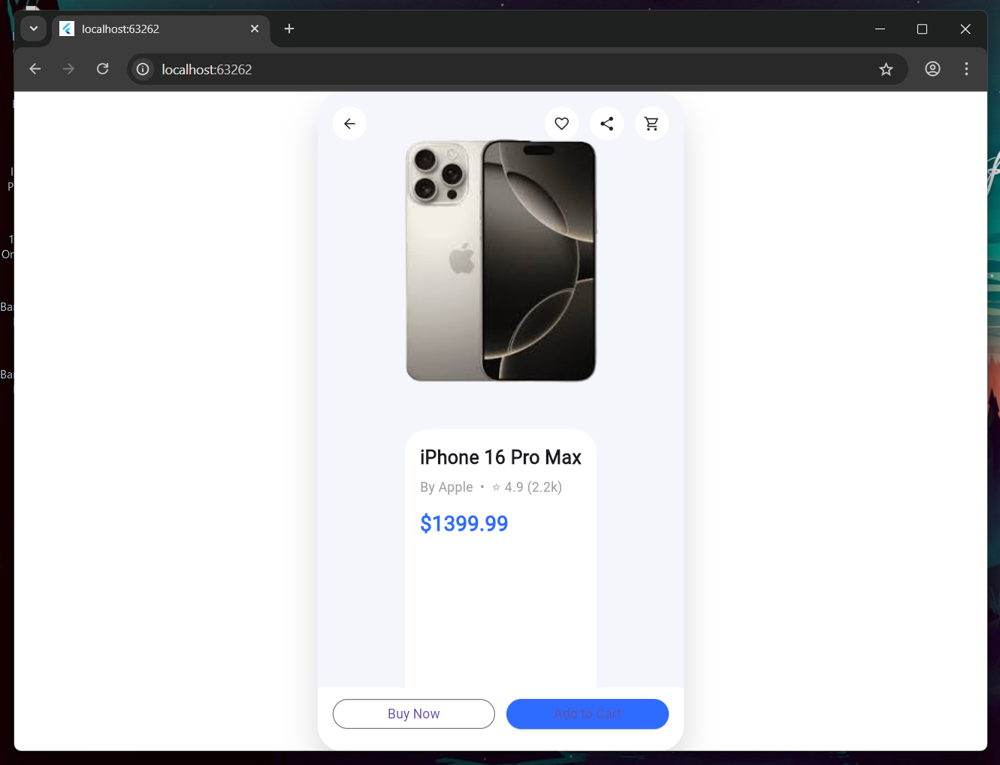

# Day 4 – Product Detail Screen & Navigation

## What I built today
- Implemented **Product Detail Screen** UI as per the given mockup
- Added **navigation from Home screen to Product Detail screen** on product tap
- Ensured **all screens render inside the PhoneFrame** for consistent mobile preview
- Implemented a **working back button** using Navigator.pop()
- Structured code into reusable widgets instead of keeping everything in `main.dart`

## Key Learnings
- Navigation in Flutter using `Navigator.push` and `Navigator.pop`
- Importance of wrapping navigated screens with layout wrappers (PhoneFrame)
- Passing data via widget constructors for scalable UI components
- Splitting UI into smaller widgets improves readability and maintainability

## Screenshots
### Home Screen


### Product Detail Screen


## Notes
- This implementation focuses purely on **UI replication**, as required
- No business logic or state management was added intentionally
- Verified on Flutter Web (Chrome) for faster UI iteration


## ✔ How to run
```bash
cd day4
flutter pub get
flutter run -d chrome
