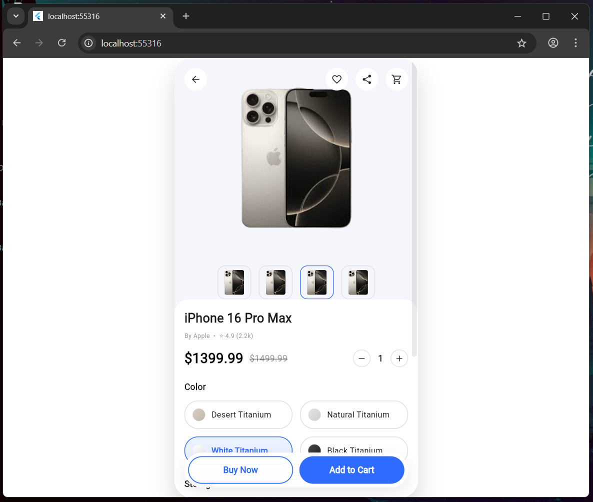
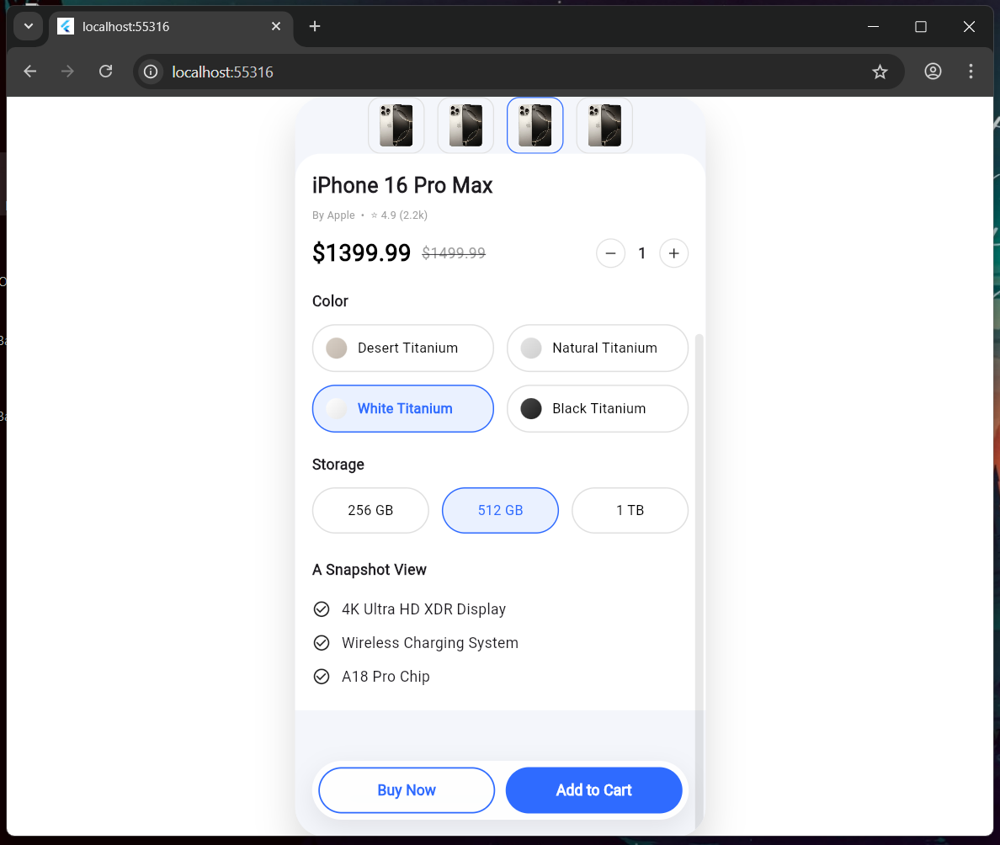

# Day 4 – Product Detail Screen & Navigation

## What I built today
- Enhanced Product Detail Screen UI to closely match the provided reference mockup
- Implemented color selection section with gradient-style options
- Implemented storage selection section with iOS-style pill buttons
- Added quantity selector (+ / −) UI
- Added product snapshot/details section below selectors
- Implemented floating bottom action bar (Buy Now / Add to Cart)
- Ensured scrollable content remains visible beneath the bottom action bar
- Maintained navigation from Home screen to Product Detail screen

## Key Learnings
- Using Stack and Positioned widgets to create floating UI elements
- Managing scrollable layouts with fixed bottom action components
- Designing reusable selector widgets for cleaner UI structure
- Achieving closer UI replication using gradients, spacing, and borders
- Improving screen composition by separating sections into focused widgets

## Screenshots

### Product Detail Screen


## Notes
- This implementation focuses purely on **UI replication**, as required
- No business logic or state management was added intentionally
- Verified on Flutter Web (Chrome) for faster UI iteration


## ✔ How to run
```bash
cd day5
flutter pub get
flutter run -d chrome
