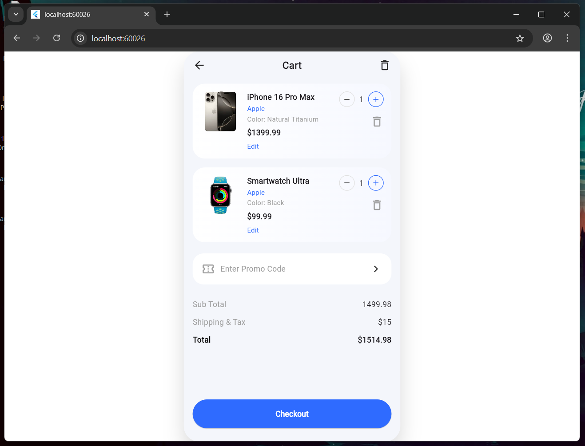

# Day 6 – Product Detail Screen & Navigation

## What I built today
- Implemented a fully designed Cart Screen UI matching the given reference
- Added navigation from Product Detail → Cart Screen via Add to Cart button
- Ensured the Cart Screen renders inside the PhoneFrame for consistent mobile preview
- Built reusable UI components for:
- Cart Header (Back + Title + Delete icon)
- Cart Item Card (Image, title, color, price, quantity selector)
- Quantity selector (+ / – buttons)
- Promo code input box
- Price summary (Subtotal, Shipping & Tax, Total)
- Checkout button
- Fixed layout issues related to SafeArea, scrolling, and bottom button overlap

## Key Learnings
- Proper widget composition using SafeArea → Column → Expanded → ScrollView
- Difference between child vs children in Flutter widgets
- Managing fixed bottom buttons while keeping content scrollable
- Reusing UI components for cleaner and maintainable code
- Handling navigation while preserving layout wrappers (PhoneFrame)

## Screenshots


## Notes
- This implementation focuses purely on **UI replication**, as required
- No business logic or state management was added intentionally
- Verified on Flutter Web (Chrome) for faster UI iteration


## ✔ How to run
```bash
cd day6
flutter pub get
flutter run -d chrome
