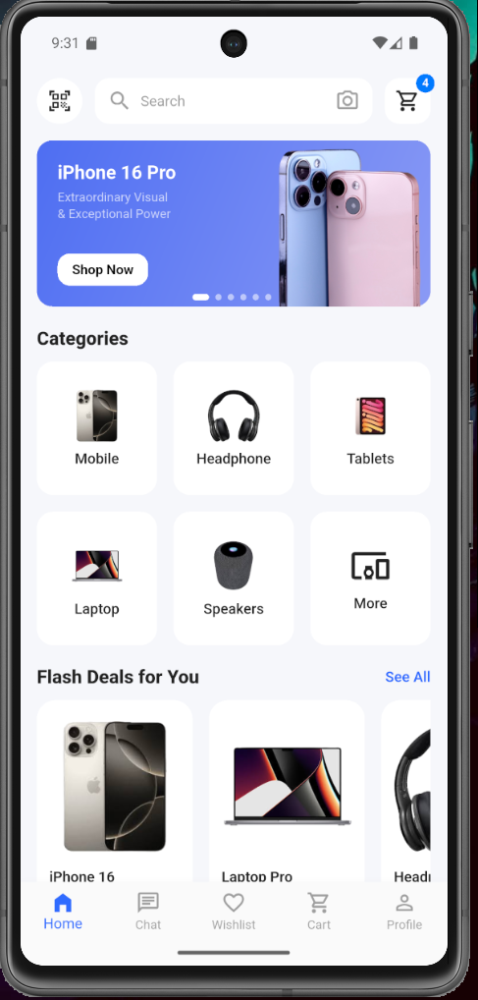
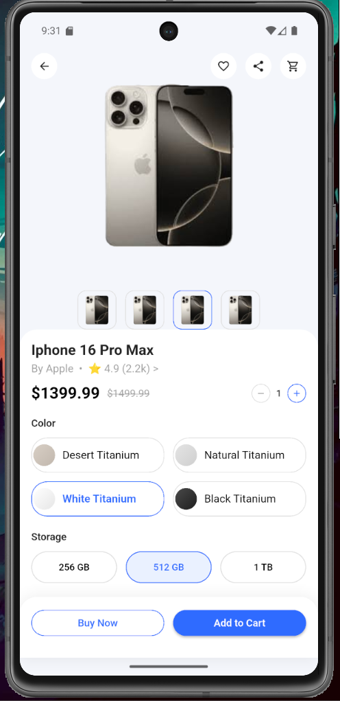
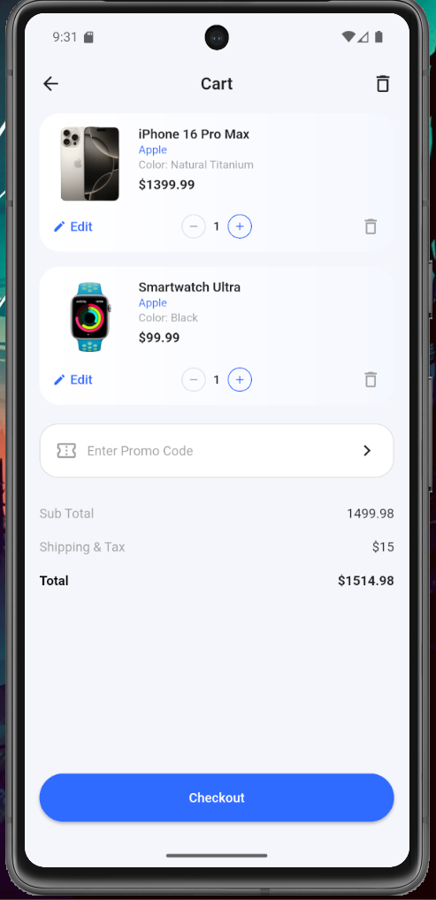

# Day 7 – Cart Screen UI & Material Layout

## What I built today
- Implemented a fully designed **Cart Screen UI** matching the given reference design
- Refined UI to follow **Material UI defaults** (Android-focused)
- Removed PhoneFrame and tested on **Android Emulator**
- Built and refined reusable UI components for:
  - Cart Header (Back + Title + Delete icon)
  - Cart Item Card (Image, title, brand, color, price)
  - Quantity selector (+ / – buttons)
  - Edit action with icon
  - Delete action aligned with quantity selector
  - Promo code input box
  - Price summary (Subtotal, Shipping & Tax, Total)
  - Checkout button fixed at the bottom
- Fixed layout issues related to:
  - Spacing and alignment
  - Scrollable content with fixed bottom CTA
  - Proper use of SafeArea and Expanded
- Matched spacing, padding, and alignment closely to the reference UI

## Key Learnings
- Structuring complex layouts using `Column → Expanded → SingleChildScrollView`
- Handling fixed bottom buttons without overlapping scrollable content
- Aligning widgets precisely using `Row`, `Expanded`, and `Align`
- Building clean, reusable stateless UI components
- Understanding platform differences (Android Material UI vs iOS design)
- Debugging common Flutter UI issues (BoxDecoration border vs outline, spacing issues)

## Screenshots




## Notes
- This implementation focuses purely on **UI replication**
- No business logic or state management was added intentionally
- Quantity selector and actions are static (UI-only)
- Tested on **Android Emulator** using default Material UI
- Fonts use **Material default typography**

## ✔ How to run
```bash
cd day7
flutter pub get
flutter run -d chrome
